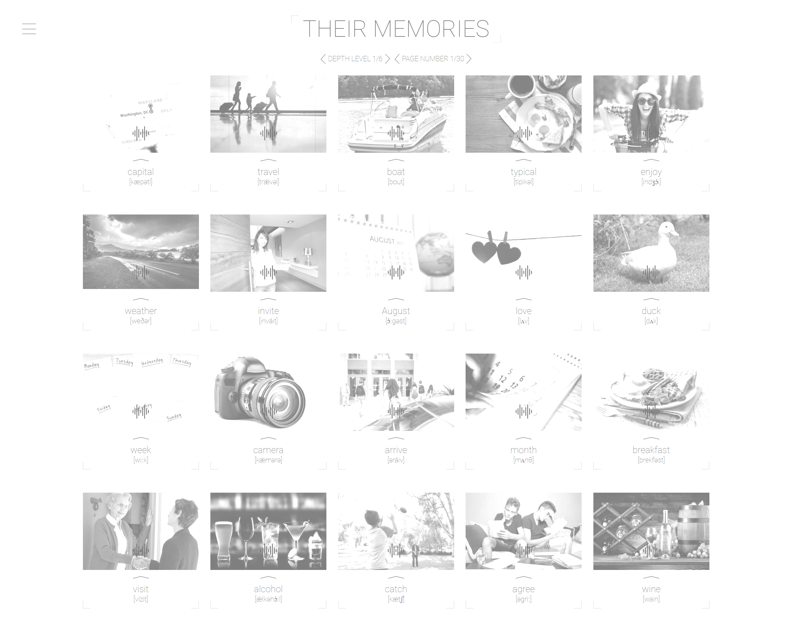
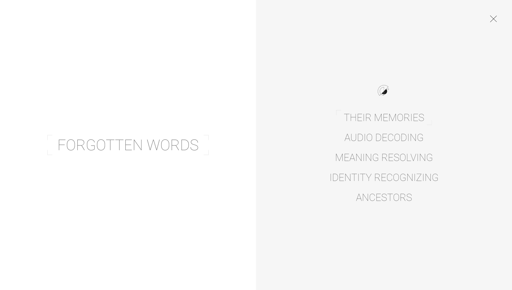
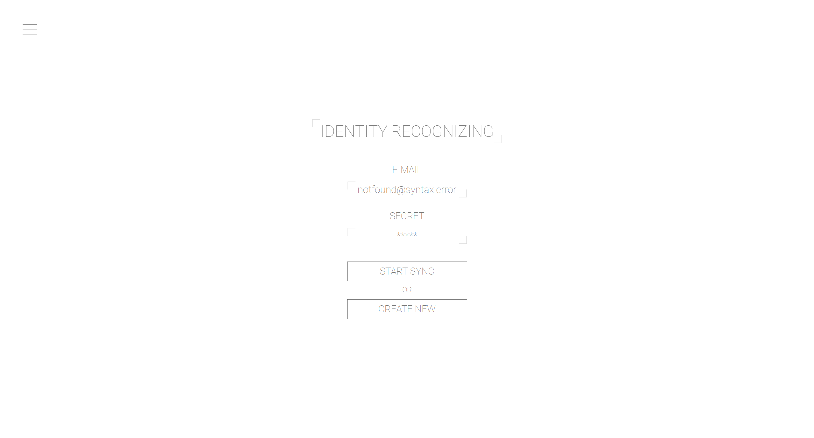
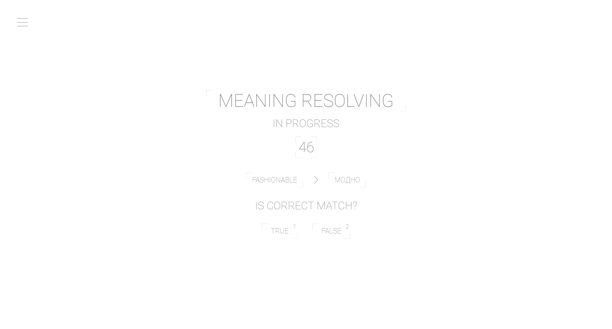

# rslang

        

## Deploy link

https://thirdmadman.github.io/rslang/

## Description

Originally RS-lang, SPA, which helps people study english language in form of game.

This is team project, done by [@thirdmadman](https://github.com/thirdmadman) and [@annettabel87](https://github.com/annettabel87)

Our name for this app is "FORGOTTEN WORDS", it serves same purpose as original, but has different way of looking at things.

## Design

Design developed by [@thirdmadman](https://github.com/thirdmadman)

Link on figma: <https://www.figma.com/file/6c9pgV98Sp7acAZIc2AFR5/rslang-ui?node-id=20%3A31>

## Screenshots

## Original Task description

<https://github.com/rolling-scopes-school/tasks/blob/master/tasks/stage-2/rs-lang/rslang.md>

Description for measure task score here: <https://github.com/thirdmadman/rslang/pull/33>
